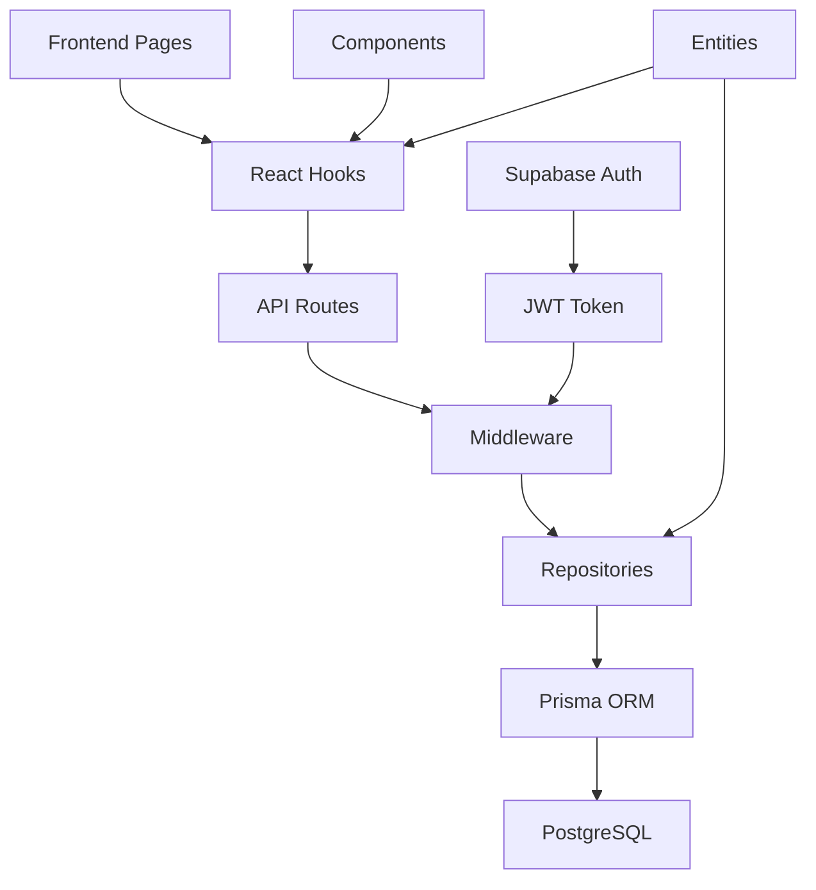

# 🏗️ SVV Car Sharing - Projektstruktur

## 📋 Überblick

Das SVV Car Sharing System ist eine **Next.js TypeScript-Anwendung** mit **Prisma ORM**, **Supabase Auth** und einem **rollenbasierten Berechtigungssystem**.

## 🗂️ Haupt-Verzeichnisse

```
svv-car-sharing/
├── src/                    # Haupt-Anwendung
├── prisma/                 # Datenbank-Schema & Migrationen
├── docs/                   # Projektdokumentation
├── public/                 # Statische Assets
├── package.json            # Dependencies & Scripts
├── dev-setup.sh            # Development Setup Script
└── create-*.js             # Setup & Import Scripts
```

## 🎯 src/ - Code-Organisation

```
src/
├── pages/                  # Next.js Pages & API Routes
│   ├── index.tsx          # Startseite (Spieltage)
│   ├── login.tsx          # Login-Seite
│   ├── admin/             # Admin-Bereich
│   └── api/               # Backend API Routes
├── components/             # UI-Komponenten
│   ├── auth/              # Authentifizierung
│   ├── admin/             # Admin-Panel
│   ├── layout/            # Layout-Komponenten
│   ├── matches/           # Spiel-Features
│   ├── rides/             # Fahrgemeinschaften
│   ├── forms/             # Formular-Komponenten
│   └── ui/                # Basis UI-Komponenten
├── hooks/                  # React Custom Hooks
│   ├── auth/              # Auth-Hooks
│   ├── matches/           # Spiel-Logik
│   └── rides/             # Fahrgemeinschafts-Logik
├── lib/                    # Backend & Utilities
│   ├── middleware/        # API Middleware
│   ├── repositories/      # Data Access Layer
│   └── *.ts               # Config & Setup
├── entities/               # Business Logic & Types
└── styles/                 # CSS & Styling
```

## 🔌 API-Struktur

```
src/pages/api/
├── admin/                  # Admin-APIs
├── auth/                   # Authentifizierung
├── matches/                # Spiel-APIs
│   ├── [matchId]/         # Spiel-Details
│   └── participation/     # Teilnahme-Management
└── rides/                  # Fahrgemeinschafts-APIs
    └── [rideId]/          # Fahrt-Details
```

## 🗄️ Datenbank (prisma/)

```
prisma/
├── schema.prisma          # Datenbank-Schema
├── seed.js                # Basis-Testdaten
└── migrations/            # Schema-Migrationen
```

## ⚙️ Konfiguration & Setup

### 📄 Haupt-Konfigurationsdateien

| Datei | Zweck | Beschreibung |
|-------|-------|-------------|
| `package.json` | Dependencies & Scripts | NPM-Pakete & Build-Scripts |
| `next.config.ts` | Next.js Konfiguration | Framework-Einstellungen |
| `tsconfig.json` | TypeScript Config | Compiler-Optionen |
| `eslint.config.mjs` | Code-Qualität | Linting-Regeln |
| `postcss.config.mjs` | CSS-Processing | PostCSS-Plugins |
| `vercel.json` | Deployment | Vercel-Deployment-Config |

### 🔐 Environment-Dateien

```
.env.example                   # 📋 Template für Environment-Variablen
.env.local                     # 🏠 Lokale Development-Umgebung
.env.production                # 🚀 Produktions-Umgebung
```


## 🔄 Datenfluss-Architektur



## 🎯 Entwicklungs-Workflows

### 🆕 Neues Feature entwickeln

1. **Entity/Types definieren** → `src/entities/`
2. **Database-Schema anpassen** → `prisma/schema.prisma`
3. **Repository erstellen** → `src/lib/repositories/`
4. **API-Route implementieren** → `src/pages/api/`
5. **Hook für Frontend erstellen** → `src/hooks/`
6. **UI-Komponenten entwickeln** → `src/components/`
7. **Page-Integration** → `src/pages/`

### 🔐 Neue Admin-Features

1. **Berechtigung definieren** → `src/entities/UserProfile.ts`
2. **API mit Admin-Check** → `src/pages/api/admin/`
3. **AdminGuard verwenden** → `src/components/admin/`
4. **Admin-Navigation erweitern** → `Layout-Komponenten`